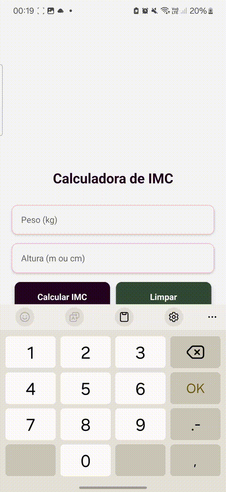

# Calculadora de IMC (React Native)

Uma calculadora simples de IMC (Índice de Massa Corporal) desenvolvida em **React Native**. Permite ao usuário inserir seu peso e altura, calcular o IMC e exibir a classificação de acordo com a tabela da OMS.

---

## Demonstração



---

## Pré-requisitos

- Node.js (versão 16 ou superior)
- npm ou yarn
- Expo CLI (opcional)
- Git

---

## Funcionalidades

- Inserção de peso (kg) e altura (m ou cm)
- Validação de altura digitada em centímetros (com alerta e conversão)
- Cálculo do IMC
- Classificação automática:
  - Abaixo do peso
  - Peso normal
  - Sobrepeso
  - Obesidade grau I, II e III
- Limpar campos
- Feedback visual com cores para cada faixa de IMC

---

## Tecnologias utilizadas

- [React Native](https://reactnative.dev/)
- [Expo](https://expo.dev/)
- JavaScript (ES6+)
-- Bibliotecas Adicionais:
    - @react-native-picker/picker
    - @react-native-community/slider
    - @expo/vector-icons

---

## Como rodar

1. Clone o repositório:
 ```bash
git clone https://github.com/Kamila-Silvva/IMCCalculator
  ```
   
2. Acesse a pasta do projeto:
```bash
cd IMCCalculator
  ```

3. Instale as dependências:

O projeto utiliza bibliotecas que é necessário instalar para o seu correto funcionamento. O comando a seguir irá baixar todas as dependências listadas no package.json

```bash
npm install
  ```

3. Inicie o projeto:
```bash
npx expo start
  ```


## Cálculo do IMC

A fórmula utilizada é: IMC = peso / (altura * altura)

## Licença

Este projeto está licenciado sob a licença MIT - veja o arquivo [LICENSE](LICENSE) para detalhes.